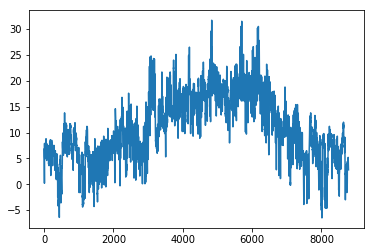
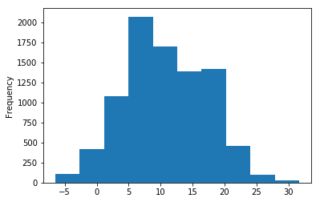
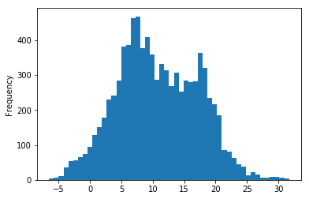

```python
import numpy as np
import pandas as pd
% matplotlib inline
```


```python
dataframe = pd.read_csv('weather.csv')
```


```python
#retorna uma tuple contendo o tamanho do Data Frame, n° de linhas e n° de colunas
dataframe.shape 
```


    (8784, 5)


```python
#informações das colunas
dataframe.info()
```

    <class 'pandas.core.frame.DataFrame'>
    RangeIndex: 8784 entries, 0 to 8783
    Data columns (total 5 columns):
    MONTH       8784 non-null int64
    DAY         8784 non-null int64
    TIME        8784 non-null int64
    TEMP        8784 non-null float64
    PRESSURE    8784 non-null int64
    dtypes: float64(1), int64(4)
    memory usage: 343.2 KB
    


```python
#retorna as primeiras 3 linhas
dataframe.head(3)
```


<div>

<table border="1" class="dataframe">
  <thead>
    <tr style="text-align: right;">
      <th></th>
      <th>MONTH</th>
      <th>DAY</th>
      <th>TIME</th>
      <th>TEMP</th>
      <th>PRESSURE</th>
    </tr>
  </thead>
  <tbody>
    <tr>
      <th>0</th>
      <td>1</td>
      <td>1</td>
      <td>1</td>
      <td>6.8</td>
      <td>10207</td>
    </tr>
    <tr>
      <th>1</th>
      <td>1</td>
      <td>1</td>
      <td>2</td>
      <td>5.8</td>
      <td>10214</td>
    </tr>
    <tr>
      <th>2</th>
      <td>1</td>
      <td>1</td>
      <td>3</td>
      <td>5.7</td>
      <td>10220</td>
    </tr>
  </tbody>
</table>
</div>


```python
#retorna as últimas 3 linhas
dataframe.tail(3)
```


<div>

<table border="1" class="dataframe">
  <thead>
    <tr style="text-align: right;">
      <th></th>
      <th>MONTH</th>
      <th>DAY</th>
      <th>TIME</th>
      <th>TEMP</th>
      <th>PRESSURE</th>
    </tr>
  </thead>
  <tbody>
    <tr>
      <th>8781</th>
      <td>12</td>
      <td>366</td>
      <td>22</td>
      <td>3.0</td>
      <td>10253</td>
    </tr>
    <tr>
      <th>8782</th>
      <td>12</td>
      <td>366</td>
      <td>23</td>
      <td>2.8</td>
      <td>10246</td>
    </tr>
    <tr>
      <th>8783</th>
      <td>12</td>
      <td>366</td>
      <td>24</td>
      <td>2.8</td>
      <td>10239</td>
    </tr>
  </tbody>
</table>
</div>


```python
#para cada coluna do dataframe a função describe retorna as informações estatísticas
dataframe.describe()
```


<div>

<table border="1" class="dataframe">
  <thead>
    <tr style="text-align: right;">
      <th></th>
      <th>MONTH</th>
      <th>DAY</th>
      <th>TIME</th>
      <th>TEMP</th>
      <th>PRESSURE</th>
    </tr>
  </thead>
  <tbody>
    <tr>
      <th>count</th>
      <td>8784.000000</td>
      <td>8784.000000</td>
      <td>8784.000000</td>
      <td>8784.000000</td>
      <td>8784.000000</td>
    </tr>
    <tr>
      <th>mean</th>
      <td>6.513661</td>
      <td>183.500000</td>
      <td>12.500000</td>
      <td>10.768613</td>
      <td>10159.254781</td>
    </tr>
    <tr>
      <th>std</th>
      <td>3.451430</td>
      <td>105.660719</td>
      <td>6.922581</td>
      <td>6.420003</td>
      <td>102.895130</td>
    </tr>
    <tr>
      <th>min</th>
      <td>1.000000</td>
      <td>1.000000</td>
      <td>1.000000</td>
      <td>-6.500000</td>
      <td>9812.000000</td>
    </tr>
    <tr>
      <th>25%</th>
      <td>4.000000</td>
      <td>92.000000</td>
      <td>6.750000</td>
      <td>6.100000</td>
      <td>10102.000000</td>
    </tr>
    <tr>
      <th>50%</th>
      <td>7.000000</td>
      <td>183.500000</td>
      <td>12.500000</td>
      <td>10.200000</td>
      <td>10169.000000</td>
    </tr>
    <tr>
      <th>75%</th>
      <td>10.000000</td>
      <td>275.000000</td>
      <td>18.250000</td>
      <td>15.900000</td>
      <td>10227.000000</td>
    </tr>
    <tr>
      <th>max</th>
      <td>12.000000</td>
      <td>366.000000</td>
      <td>24.000000</td>
      <td>31.700000</td>
      <td>10453.000000</td>
    </tr>
  </tbody>
</table>
</div>


```python
#retorna a temperatura média da coluna 'TEMP' do dataframe
dataframe['TEMP'].mean()
```


    10.768613387978167


```python
dataframe['TEMP'].plot()
```


    <matplotlib.axes._subplots.AxesSubplot at 0x9a1cfd0>





```python
dataframe['TEMP'].plot.hist()
```


    <matplotlib.axes._subplots.AxesSubplot at 0x9c11c88>





```python
dataframe['TEMP'].plot.hist(bins=50)
```


    <matplotlib.axes._subplots.AxesSubplot at 0xad2f198>




